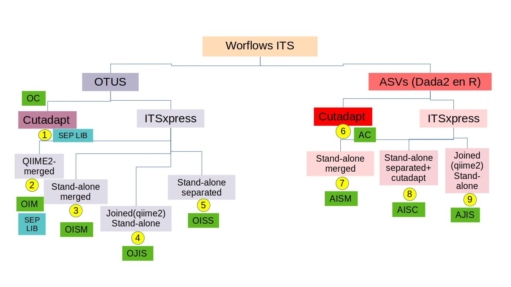

```{r setup, include=FALSE}
knitr::opts_chunk$set(echo = TRUE)
```

## MÉTODOS

Para establecer el mejor flujo de trabajo se siguieron varios flujos de trabajos según detalla la Figura 1.
```{r figs, echo=FALSE, fig.width=7,fig.height=6 ,fig.cap = "Figura 1. Métodos"}

```

Claves de cada método:

- OC : Cutadapt + OTUS (qiime2)
- OIM : Itsxpress dentro de qiime2 y luego exportado (para remover empty seqs) y luego importado nuveamente para seguir con el flujo de trabajo de OTUS.
- OISM : Itsxpress standalone (por fuera) con la opción de que hiciera el merged y luego importadas a qiime2 (unidas), seguido por OTUS como single.
- OJIS : Reads joined dentro de qiime2 y luego exportadas para Itsxpress y luego importadas a qiime2 nuevamente para seguir el flujo de OTUs.
- OISS :  Itsxpress standalone (por fuera) con la opción de que NO hiciera el merged y luego importadas a qiime2 (separados), seguido por unidas con vsearch y luego flujo de OTUS.

- AC : Cutadapt + DADA2 (en R) y luego importadas para lo demás en qiime2
- AISM : Itsxpress standalone (por fuera) con la opción de que hiciera el merged y DADA2 (en R) luego importadas a qiime2 
- AJIS : Reads joined dentro de qiime2 y luego exportadas para Itsxpress y DADA2 (en R), luego importadas a qiime2 
- AISC :  Itsxpress standalone (por fuera) con la opción de que NO hiciera el merged y DADA2 (en R) luego importadas a qiime2 (separados), necesitaron cutadapat en DADA2 porque en algunos casos salieron primers. 


## RESUMEN READS Y FEATURES

Según los diferentes métodos seguidos se obtuvieron diferentes resultados de número de reads y features (otus o asvs).

```{r, echo=FALSE, message=FALSE, warning=FALSE}
library(tidyverse)
library(ggpubr)
table_features_reads<- read.csv("../Data/table_features_reads.csv", row.names = 1)
resume_features<- read.csv("../Data/resume_features.csv", row.names = 1)
resume_features_single<- read.csv("../Data/resume_features_single.csv", row.names = 1)
levels_df<- read.csv("../Data/levels_df.csv", row.names = 1)
```


#### Table 1. Features y Reads totales por método

```{r, echo=FALSE, message=FALSE, warning=FALSE}
DT::datatable(
  table_features_reads,
  fillContainer = FALSE, 
  filter="top")
```

#### Table 2. Readas por muestra

```{r, echo=FALSE, message=FALSE, warning=FALSE}
DT::datatable(
  as.data.frame(t(round(resume_features))) %>% rownames_to_column(var = "method"),
  fillContainer = FALSE, 
  filter=list(position = 'top', clear = TRUE, plain = FALSE)
)
```

#### Table 3. Reads por muestra removiendo singletons

```{r, echo=FALSE, message=FALSE, warning=FALSE}
DT::datatable(
  as.data.frame(t(round(resume_features_single))) %>% rownames_to_column(var = "method"),
  fillContainer = FALSE, 
  filter=list(position = 'top', clear = TRUE, plain = FALSE)
)
```

#### Table 4. Número de taxas a cada nivel taxonómico

```{r, echo=FALSE, message=FALSE, warning=FALSE}
DT::datatable(
  levels_df %>% rownames_to_column(var = "method"),
  fillContainer = FALSE, 
  filter=list(position = 'top', clear = TRUE, plain = FALSE)
)

```

## ALPHA DIVERSIDAD

```{r, echo=FALSE, message=FALSE, warning=FALSE,fig.width=7,fig.height=6,fig.cap = "Figura 2. Alpha diversidad a todos los órdenes" }
library(plotly)
qs<- read.csv("../Data/qs.csv")
fig <- plot_ly(qs, x = ~order, y = ~val, color = ~ids, type = "box")
fig <- fig %>% layout(boxmode = "group")

fig
```

```{r, echo=FALSE, message=FALSE, warning=FALSE,fig.width=7,fig.height=6,fig.cap = "Figura 3. Alpha diversidad por polígono al orden q=0" }
metadata<- read.delim("../Data/its_map.txt")
fig <- plot_ly(qs %>% filter(order=="q0") %>% inner_join(metadata), x = ~ids, y = ~val, color = ~Poligono, type = "box")
fig <- fig %>% layout(boxmode = "group")

fig
```

```{r, echo=FALSE, message=FALSE, warning=FALSE,fig.width=7,fig.height=6,fig.cap ="Figura 4. Alpha diversidad por polígono al orden q=1"}
fig <- plot_ly(qs %>% filter(order=="q1") %>% inner_join(metadata) %>% filter(Season=="Dry") , x = ~ids, y = ~val, color = ~Poligono, type = "box")
fig <- fig %>% layout(boxmode = "group")

fig
```

```{r, echo=FALSE, message=FALSE, warning=FALSE,fig.width=7,fig.height=6,fig.cap ="Figura 5. Alpha diversidad por polígono al orden q=2"}
fig <- plot_ly(qs %>% filter(order=="q2") %>% inner_join(metadata) %>% filter(Season=="Dry") , x = ~ids, y = ~val, color = ~Poligono, type = "box")
fig <- fig %>% layout(boxmode = "group")

fig
```

## BETA DIVERSIDAD


```{r, echo=FALSE, message=FALSE, warning=FALSE, fig.width=7, fig.cap="Fig 7. PCA's todos los métodos"}
library(qiime2R)
#taxonomys
taxa_oc<- read_qza("../Data/taxonomy_oc.qza")$data
taxa_oim<- read_qza("../Data/taxonomy_oim.qza")$data
taxa_oism<- read_qza("../Data/taxonomy_oism.qza")$data
taxa_ojis<- read_qza("../Data/taxonomy_ojis.qza")$data
taxa_oiss<- read_qza("../Data/taxonomy_oiss.qza")$data
taxa_ac<- read_qza("../Data/taxonomy_sklearn_ac.qza")$data
taxa_aism<- read_qza("../Data/taxonomy_sklearn_aism.qza")$data
taxa_aisc<- read_qza("../Data/taxonomy_sklearn_aisc.qza")$data
taxa_ajis<- read_qza("../Data/taxonomy_ajis.qza")$data
pcas<- readRDS("../Data/pcas.RDS")
pca_new<-function(pca, scales, taxonomys, feature){
  metadata1<- as.data.frame(pca$x) %>% rownames_to_column(var = "SampleID") %>% 
    inner_join(metadata)
  y<-ggordiplots::gg_ordiplot(pca, metadata1$Poligono, hull = FALSE, 
                              spiders = TRUE,  ellipse = FALSE,   pt.size = 4,
                              plot =FALSE, label = FALSE)
  
  # Basic ordination plot:
  xlab <- y$plot$labels$x
  ylab <- y$plot$labels$y
  z<-ggplot()+ geom_point(data = y$df_ord %>% rownames_to_column(var="SampleID") %>% 
                            inner_join(metadata1),
                          aes(x = x, y = y, color = Group, shape=Season), size = 3) + xlab(xlab) + 
    ylab(ylab)+
    
    # Plot spiders:
    geom_segment(data = y$df_spiders, aes(x = cntr.x, xend = x, y = cntr.y, yend = y, color = Group), 
                 show.legend = FALSE)+
      #geom_label(
    #data = y$df_mean.ord,
    #aes(x = x, y = y, label=Group), 
  #  label.padding = unit(0.15, "lines"),label.size = 0.4  )+
  guides(
    color=guide_legend(title="Sites"))+theme_linedraw() +
    geom_vline(xintercept = 0, linetype = 2) +   #lines-cross
    geom_hline(yintercept = 0, linetype = 2) +
    theme_linedraw()+
    scale_fill_viridis_d(option ="turbo", name="Poligono")+#color of points 
    scale_color_viridis_d(option ="turbo" )+#color of points 
    theme(axis.text = element_text(colour = "black", size = 12),
          axis.title = element_text(colour = "black", size = 12),
          legend.text = element_text(size = 10),
          legend.title = element_text(size = 12), 
          legend.position = "right", 
          legend.box = "vertical",
          panel.grid.major = element_blank(),
          panel.grid.minor = element_blank())+
    geom_text(data=data.frame(pca$rotation) %>%   #arrows
                                rownames_to_column(var = "Feature.ID")%>%  
                                mutate(a=sqrt(PC1^2+PC2^2)) %>% # calculate the distance from the origin
                                top_n(5, a) %>% #keep 10 furthest away points
                                mutate(PC1=PC1*scales, PC2=PC2*scales)%>% left_join(
                                  taxonomys)%>% dplyr::select(
                                    Taxon, PC1, PC2, Feature.ID)%>%
                                mutate_at(
                                  c("Taxon"), ~str_replace(
                                    .,";s__unidentified", ""))%>%
                                mutate_at(
                                  c("Taxon"), ~str_replace(
                                    .,";g__unidentified", "")) %>% mutate(
                                      tax= str_extract(Taxon, "[^;s__]\\w+$")) %>%
                                mutate_at(c("tax"), funs(tax = case_when(
                                  tax=="Fungi" ~ "Unidentified",
                                  tax=="pseudograminearum"~"Fusarium",
                                  tax=="oryzae"~ "Aspergillus oryzae",
                                  tax=="oreades"~ "",
                                  tax=="solani"~"Rhizoctonia solani",
                                  tax=="romaleae"~"Encephalitozoon romaleae",
                                  tax=="Pseudogymnoascus verrucosus"~"",
                                  tax=="sajor_caju" ~ "Lentinus",
                                  TRUE~as.character(tax)))),
                              aes(x=PC1, y=PC2, label= tax),
                             # segment.colour = NA,
               col = 'black', fill= "#EEEEEE",
                              fontface="italic", 
              # label.r = unit(0.1, "cm"),
               size=4, 
               nudge_y = 0.25,nudge_x = 0.25,
             #  label.padding = unit(0.05, "cm"),
               check_overlap = TRUE

    )
  return(z)}

a<-pca_new(pca =  pcas[[1]], taxonomys = taxa_oc, scales =1200)+theme(legend.position = "none")+ggtitle("OC")
b<-pca_new(pca = pcas[[2]], taxonomys = taxa_oim, scales = 900)+theme(legend.position = "none")+ggtitle("OIM")
c<-pca_new(pca = pcas[[3]], taxonomys = taxa_oism, scales = 1000)+theme(legend.position = "none")+ggtitle("OISM")
d<-pca_new(pca = pcas[[4]], taxonomys = taxa_ojis, scales = 1800)+theme(legend.position = "none")+ggtitle("OJIS")
e<-pca_new(pca = pcas[[5]], taxonomys = taxa_oiss, scales = 800)+theme(legend.position = "none")+ggtitle("OISS")
f<-pca_new(pca = pcas[[6]], taxonomys = taxa_ac, scales = 500)+theme(legend.position = "none")+ggtitle("AC")
g<-pca_new(pca = pcas[[7]], taxonomys = taxa_aism, scales = 800)+theme(legend.position = "none")+ggtitle("AISM")
h<-pca_new(pca = pcas[[8]], taxonomys = taxa_aisc, scales = 800)+theme(legend.position = "none")+ggtitle("AISC")
i<-pca_new(pca = pcas[[9]], taxonomys = taxa_ajis, scales = 800)+theme(legend.position = "none")+ggtitle("AJIS")

ggplotly(a)
ggplotly(b)
ggplotly(c)
ggplotly(d)
ggplotly(e)
ggplotly(f)
ggplotly(g)
ggplotly(h)
ggplotly(i)


```

```{r,echo=FALSE, warning=FALSE, message=FALSE}
tab<- read.csv("../Data/tab.csv", row.names = 1)
tab2<- read.csv("../Data/tab2.csv", row.names = 1)

library(ggpubr)
t1<-ggtexttable(tab2, theme = ttheme("blank"), rows = NULL) %>% 
  tab_add_hline(at.row = c(1, 2), row.side = "top", linewidth = 3, linetype = 1) %>%
  tab_add_hline(at.row = c(10), row.side = "bottom", linewidth = 3, linetype = 1) %>%
  tab_add_vline(at.column = 2:tab_ncol(.), column.side = "left", from.row = 2, linetype = 2) %>%
  table_cell_font(row = 2:tab_nrow(.), column = 4, face = "bold") %>% 
   tab_add_title(text = "Table 5. Resultados del \n permanova", face = "italic", padding = unit(1, "line"), size = 10) 

t2<-ggtexttable(tab, theme = ttheme("blank"), rows = NULL) %>% 
  tab_add_hline(at.row = c(1, 2), row.side = "top", linewidth = 3, linetype = 1) %>%
  tab_add_hline(at.row = c(10), row.side = "bottom", linewidth = 3, linetype = 1) %>%
  tab_add_vline(at.column = 2:tab_ncol(.), column.side = "left", from.row = 2, linetype = 2) %>%
  table_cell_font(row = c(7,8,9), column = 3, face = "bold") %>% 
   tab_add_title(text = "Table 6. Resultados del \n permdisp", face = "italic", padding = unit(1, "line"), size = 10) 

  
library(cowplot)
plot_grid(t1, t2, cols = 2)
```


## BETAPART - Turnover and Nestedness

```{r, echo=FALSE, warning=FALSE, message=FALSE, fig.width=7, fig.height=3, fig.cap="Fig. 8 Betadsiper todos los métodos"}
plot_jac<- readRDS("../Data/plot_jac.RDS")
plot_turn<- readRDS("../Data/plot_turn.RDS")
plot_nes<- readRDS("../Data/plot_nes.RDS")

subplot(plot_jac[[1]]+theme(legend.position = "none", title = element_text(size = 8))+ggtitle("OC"), 
        plot_turn[[1]]+theme(legend.position = "none"),
        plot_nes[[1]]+theme(legend.position = "none"))

subplot(plot_jac[[2]]+theme(legend.position = "none", title = element_text(size = 8))+ggtitle("OIM"), 
        plot_turn[[2]]+theme(legend.position = "none"),
        plot_nes[[2]]+theme(legend.position = "none"))

subplot(plot_jac[[3]]+theme(legend.position = "none", title = element_text(size = 8))+ggtitle("OISM"), 
        plot_turn[[3]]+theme(legend.position = "none"),
        plot_nes[[3]]+theme(legend.position = "none"))

subplot(plot_jac[[4]]+theme(legend.position = "none", title = element_text(size = 8))+ggtitle("OJIS"), 
        plot_turn[[4]]+theme(legend.position = "none"),
        plot_nes[[4]]+theme(legend.position = "none"))
plot<- cowplot::plot_grid(plot_jac[[4]]+ylab("DIM1")+xlab("DIM2")+theme(legend.position = "none", title = element_text(size = 8))+theme(aspect.ratio =8/10), 
        plot_turn[[4]]+theme(legend.position = "none")+theme(aspect.ratio =8/10),
        plot_nes[[4]]+theme(legend.position = "none")+theme(aspect.ratio =8/10), nrow = 1, labels = c("a) beta", "b) turnover", "c) nestedness"))

plot

ggsave("pcoas.png",width =10, height =3.5, dpi = 300, plot = plot, device = "png")

subplot(plot_jac[[5]]+theme(legend.position = "none", title = element_text(size = 8))+ggtitle("OISS"), 
        plot_turn[[5]]+theme(legend.position = "none"),
        plot_nes[[5]]+theme(legend.position = "none"))

subplot(plot_jac[[6]]+theme(legend.position = "none", title = element_text(size = 8))+ggtitle("AC"), 
        plot_turn[[6]]+theme(legend.position = "none"),
        plot_nes[[6]]+theme(legend.position = "none"))

subplot(plot_jac[[7]]+theme(legend.position = "none", title = element_text(size = 8))+ggtitle("AISM"), 
        plot_turn[[7]]+theme(legend.position = "none"),
        plot_nes[[7]]+theme(legend.position = "none"))

subplot(plot_jac[[8]]+theme(legend.position = "none", title = element_text(size = 8))+ggtitle("AISC"), 
        plot_turn[[8]]+theme(legend.position = "none"),
        plot_nes[[8]]+theme(legend.position = "none"))

subplot(plot_jac[[9]]+theme(legend.position = "none", title = element_text(size = 8))+ggtitle("AJIS"), 
        plot_turn[[9]]+theme(legend.position = "none"),
        plot_nes[[9]]+theme(legend.position = "none"))


```

### BETAPART: temporal/season

```{r,echo=FALSE, fig.width=7, warning=FALSE, message=FALSE}
table_jacs<- read.csv("../Data/table_jacs.csv", row.names = 1)
table_turns<- read.csv("../Data/table_turns.csv", row.names = 1)
table_ness<- read.csv("../Data/table_ness.csv", row.names = 1)
```


```{r,echo=FALSE, fig.width=7, warning=FALSE, message=FALSE, fig.cap="Fig 9. Beta jaccard  temporal"}
fig <- plot_ly(table_jacs , x = ~Method, y = ~beta, color = ~Poligono, type = "box")
fig <- fig %>% layout(boxmode = "group")

fig
```

```{r,echo=FALSE, fig.width=7, warning=FALSE, message=FALSE, fig.cap="Fig 9. Beta jaccard  recambio temporal"}
fig <- plot_ly(table_turns , x = ~Method, y = ~beta, color = ~Poligono, type = "box")
fig <- fig %>% layout(boxmode = "group")

fig
```

```{r,echo=FALSE, fig.width=7, warning=FALSE, message=FALSE, fig.cap="Fig 9. Beta jaccard nestedness temporal"}
fig <- plot_ly(table_ness , x = ~Method, y = ~beta, color = ~Poligono, type = "box")
fig <- fig %>% layout(boxmode = "group")

fig
```

## ASIGNACIÓN TAXONÓMICA
```{r, echo=FALSE, message=FALSE, warning=FALSE, fig.cap="Fig 10. Heatmap"}

heats<- readRDS("../Data/heats.RDS")
heats

```

```{r, echo=FALSE, message=FALSE, warning=FALSE, fig.cap="Fig 10. Heatmap"}
my_palette <- viridis::viridis(n = 12, option = "F", direction = -1)
merge_data<- read.csv("../Data/merge_data.csv", row.names = 1)
merges<- merge_data %>%  
  mutate(total = rowSums(.)) %>% arrange(-total) %>% dplyr::select(-total)

m <- as.matrix(merges)


fig <- plot_ly(
  x =colnames(merge_data), y = rownames(merge_data),
  z = m, type = "heatmap", colors = my_palette,
)
fig
```

```{r, echo=FALSE, message=FALSE, warning=FALSE}

library(ggmsa)
#protein_sequences <- system.file("extdata", "sample.fasta", package = "ggmsa")
sequences <- "~/Documents/ITS_corredor/seqs_check.fasta"

#png("align.png",width=12,height=4, units = "in", res=1200)
ggmsa(sequences, start =0, end = 680, char_width = 0.5, seq_name = T, font = NULL, color = "Chemistry_NT") + geom_seqlogo(color = "Chemistry_NT") + geom_msaBar()
#dev.off()


```

